# Chess Evaluation Coefficients Visualization

## PSqT 0

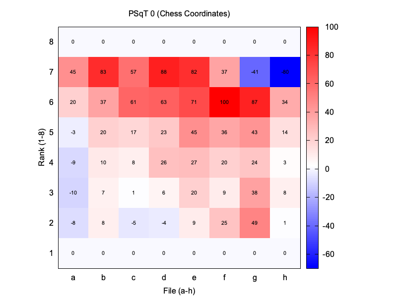

## PSqT 1

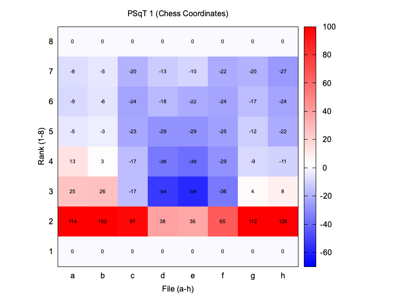

## PSqT 2

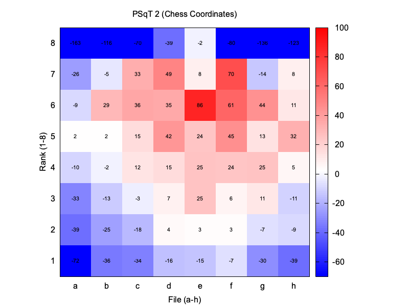

## PSqT 3

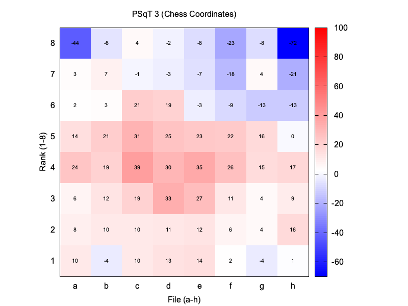

## PSqT 4

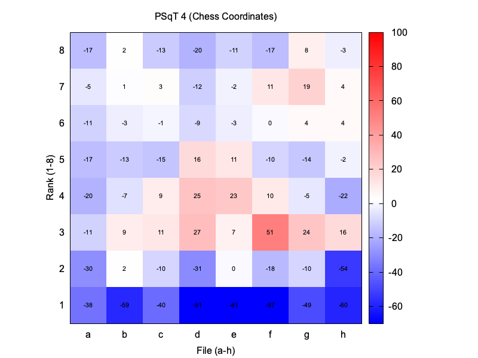

## PSqT 5

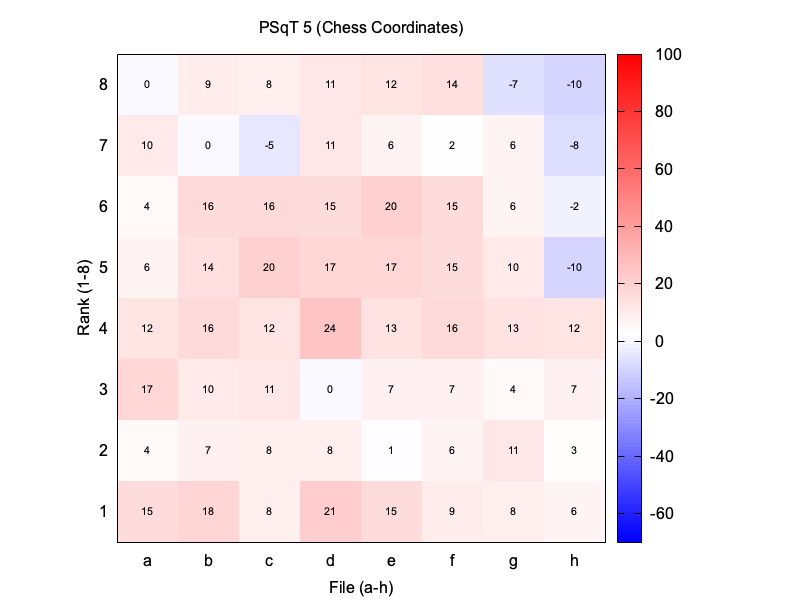

## PSqT 6

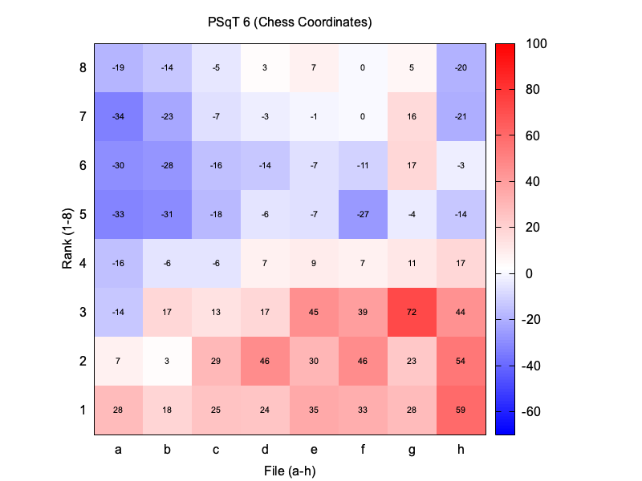

## PSqT 7

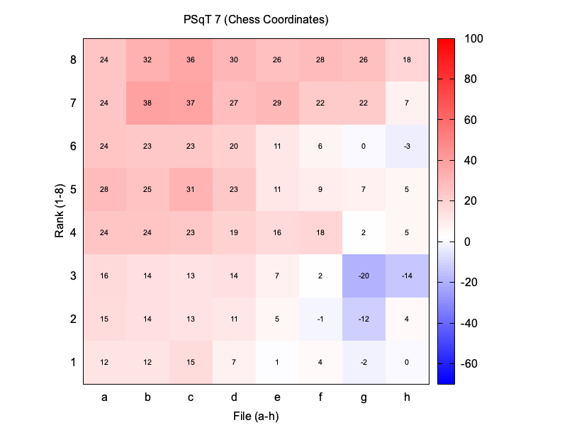

## PSqT 8

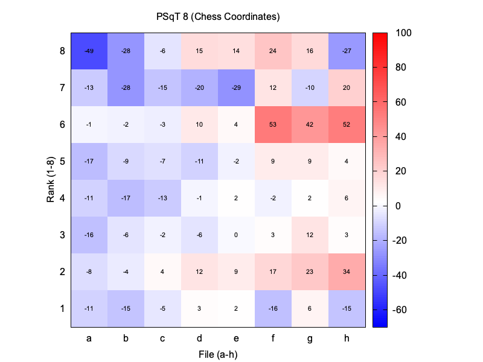

## PSqT 9

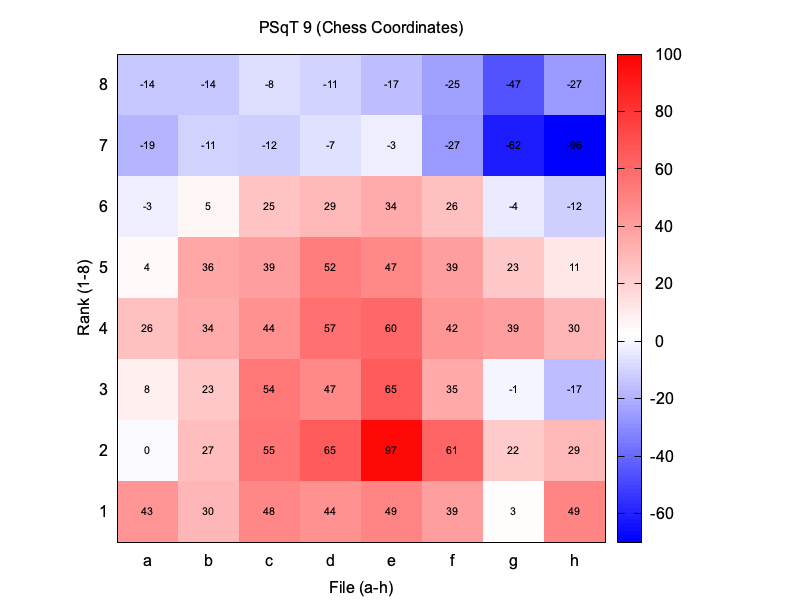

## PSqT 10

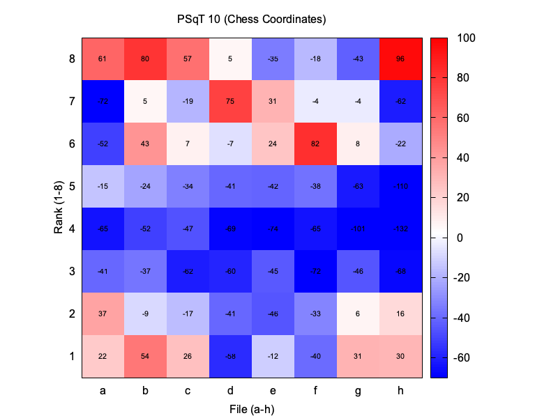

## PSqT 11

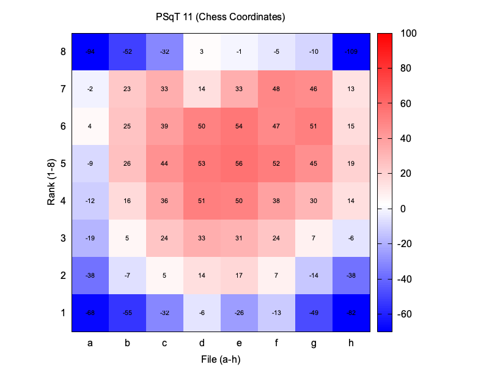

## PieceValues

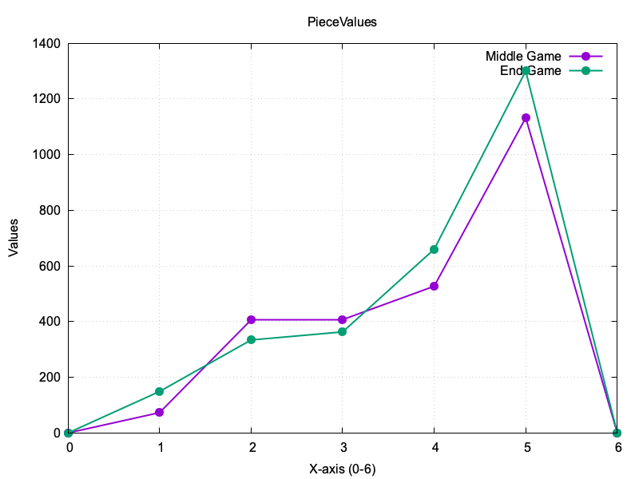

## KingAttackPieces

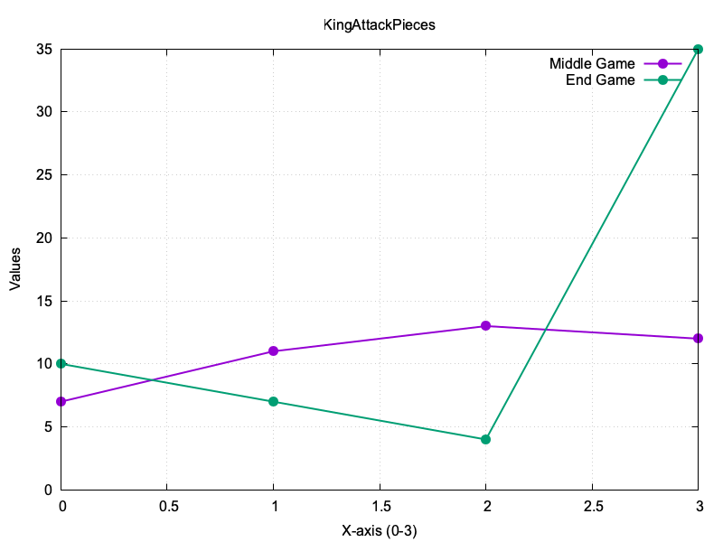

## SafeChecks

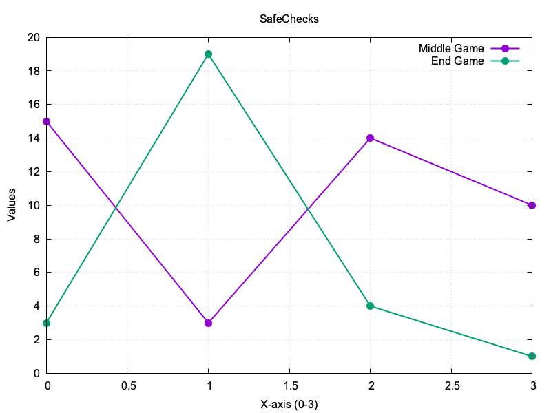

## MobilityKnight

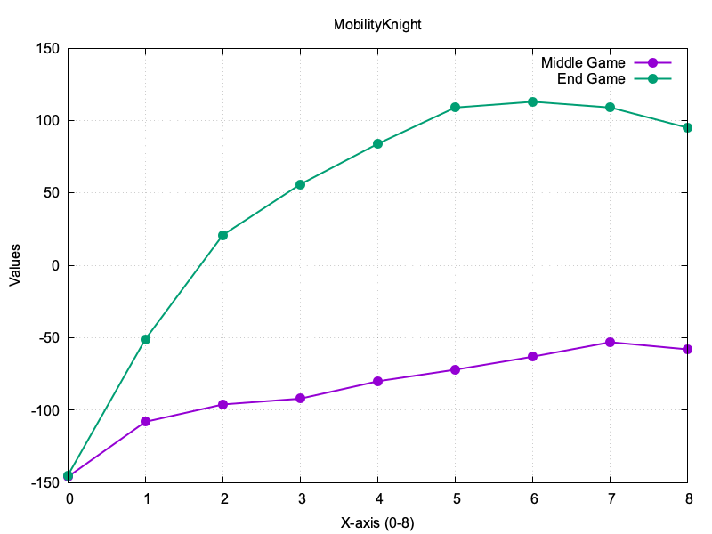

## MobilityBishop

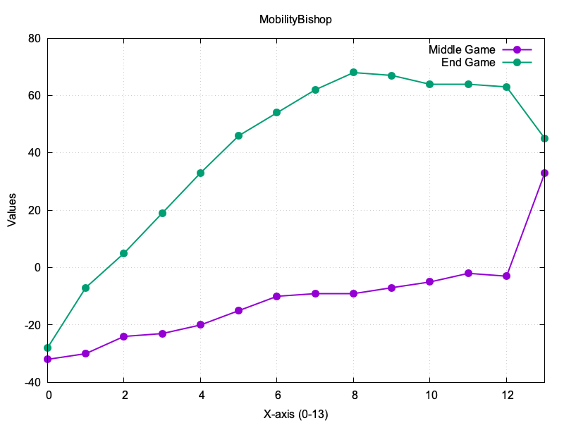

## MobilityRook

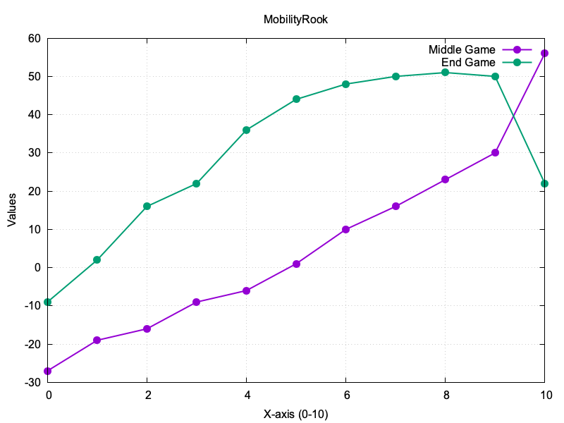

## KnightOutpost

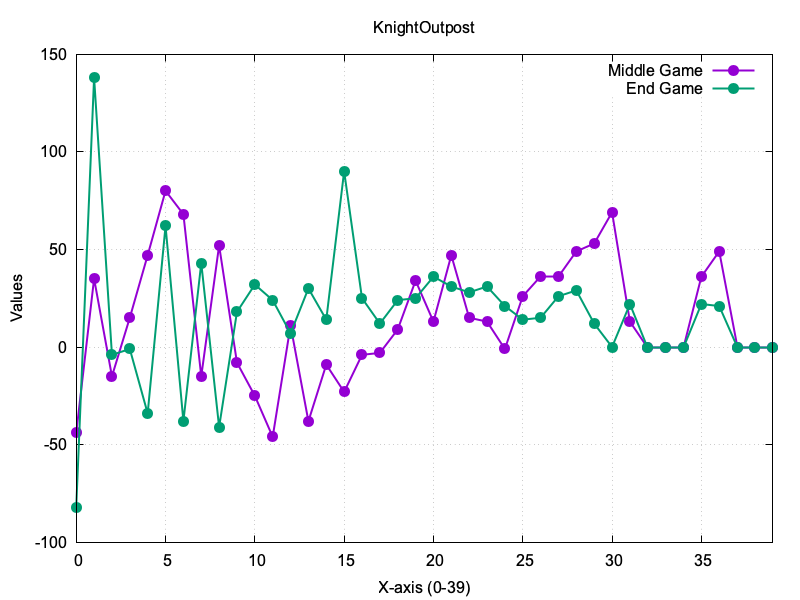

## PasserRank

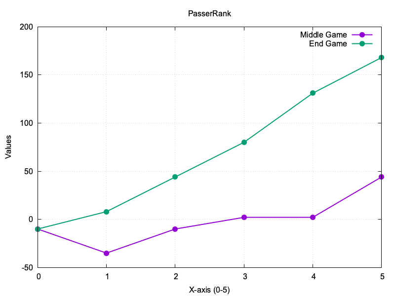

