# Chess Evaluation Coefficients Visualization

## PSqT Pawn MiddleGame

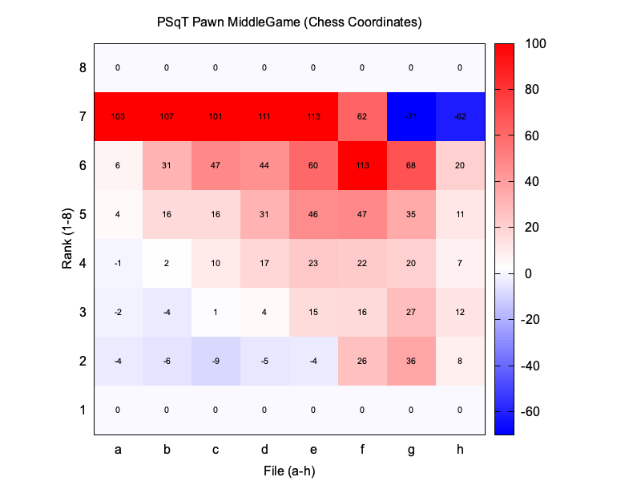

## PSqT Pawn EndGame

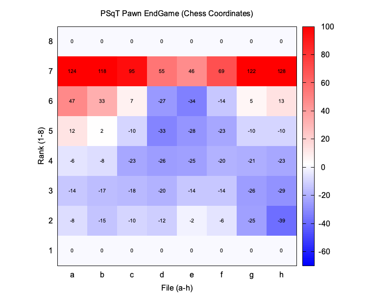

## PSqT Knight MiddleGame

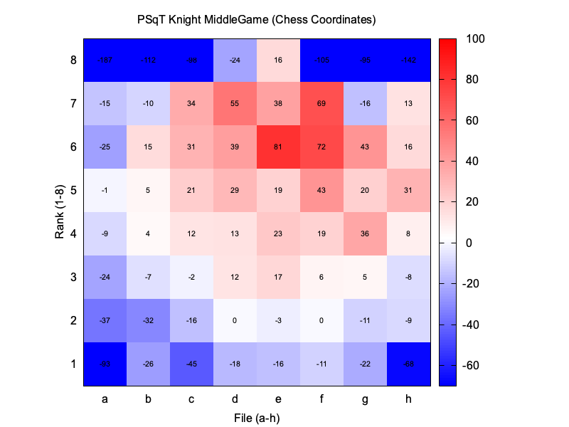

## PSqT Knight EndGame

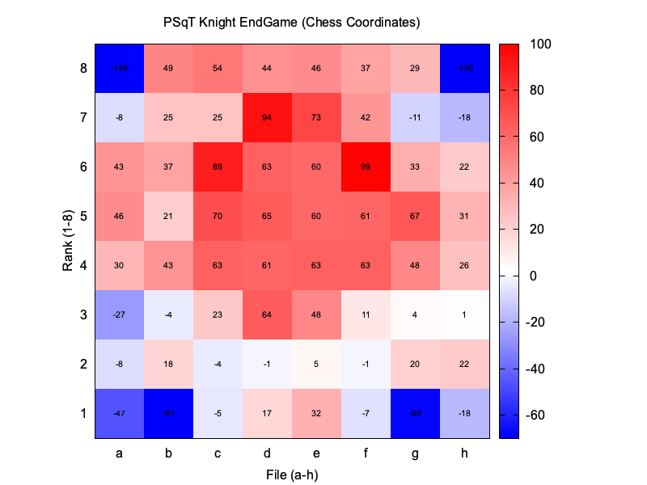

## PSqT Bishop MiddleGame

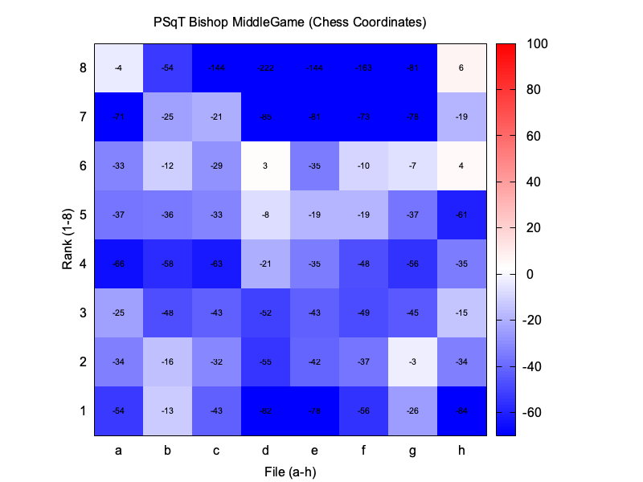

## PSqT Bishop EndGame

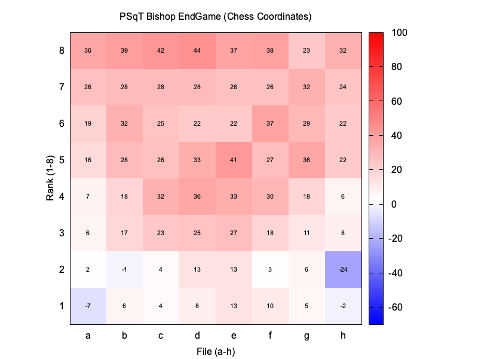

## PSqT Rook MiddleGame

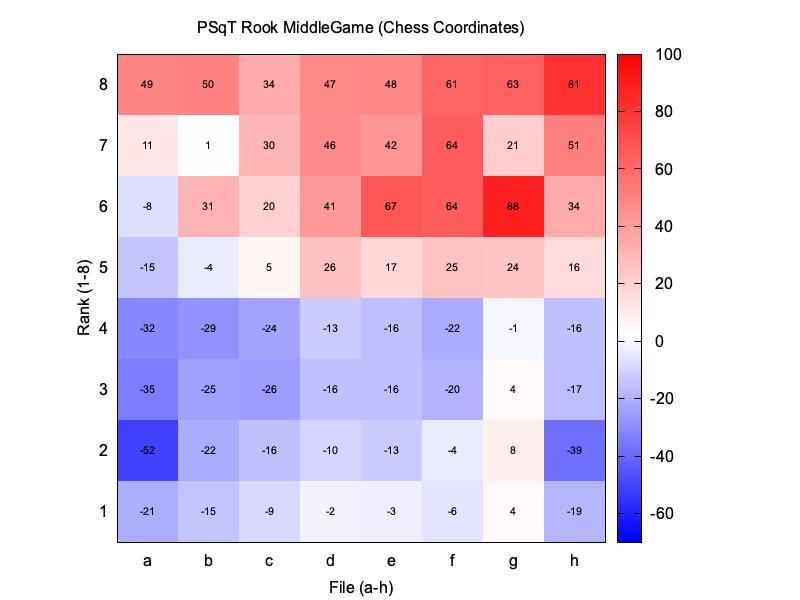

## PSqT Rook EndGame

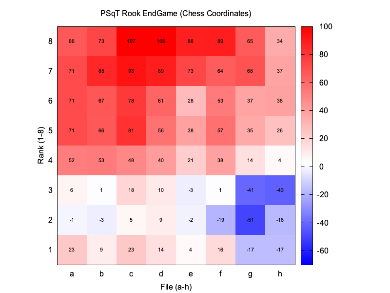

## PSqT Queen MiddleGame

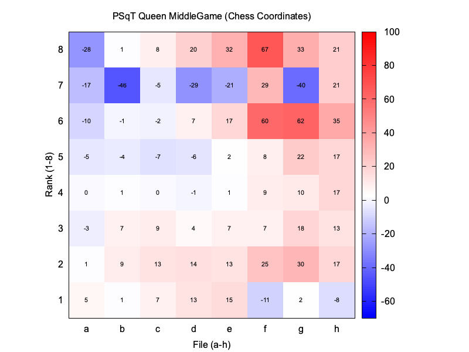

## PSqT Queen EndGame

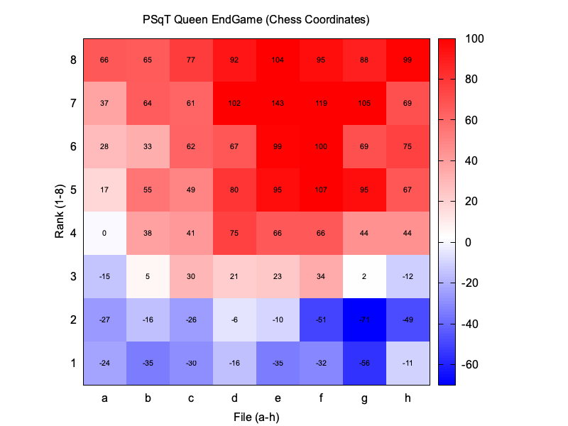

## PSqT King MiddleGame

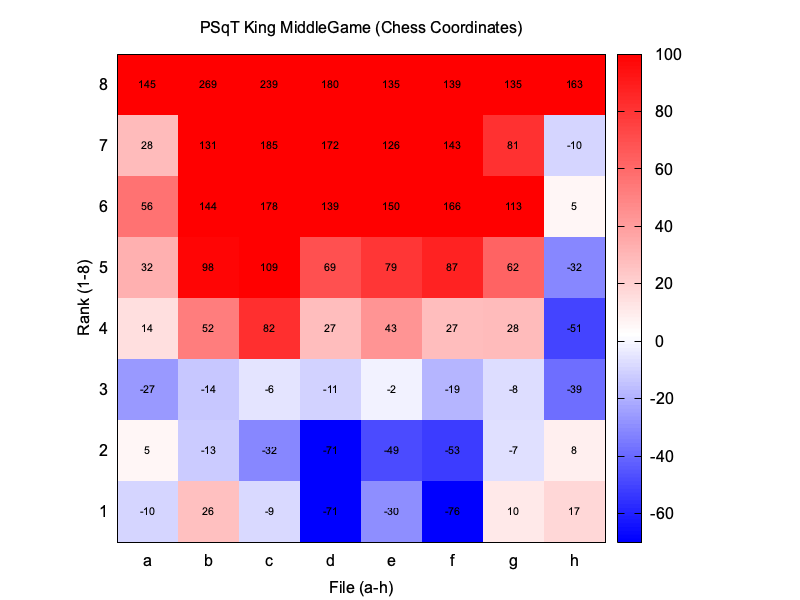

## PSqT King EndGame

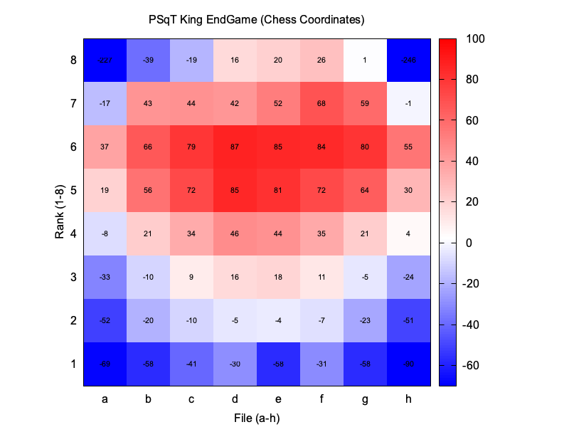

## PieceValues

## TempoBonus

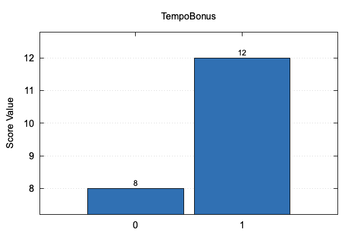

Middle Game: 14 | End Game: 13

## KingAttackPieces

## SafeChecks

## KingShelter

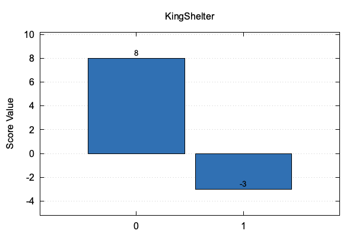

Middle Game: 7 | End Game: -1

## MobilityKnight

## MobilityBishop

## MobilityRook

## KnightOutpost (Middle Game)

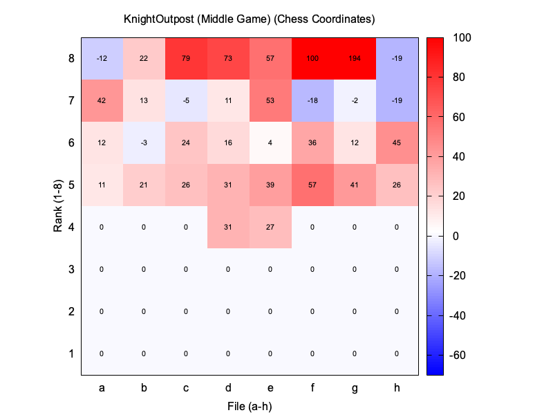

## KnightOutpost (End Game)

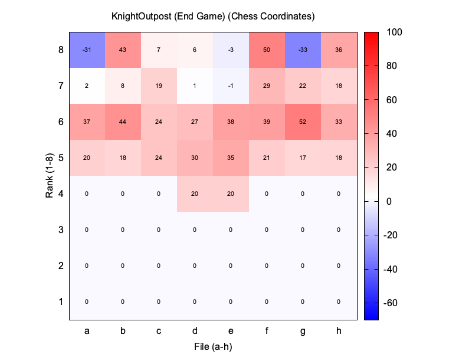

## ConnectedRooks

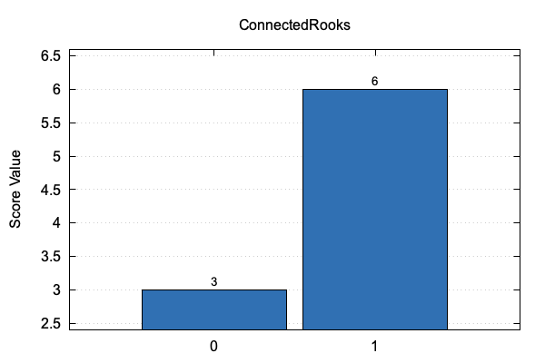

Middle Game: 2 | End Game: 14

## BishopPair

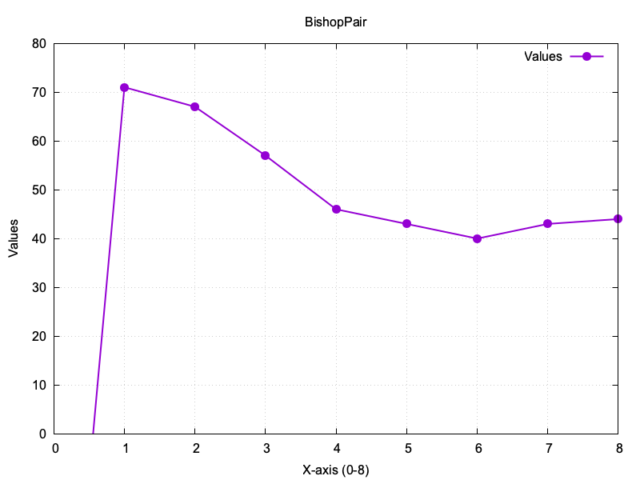

## ProtectedPasser

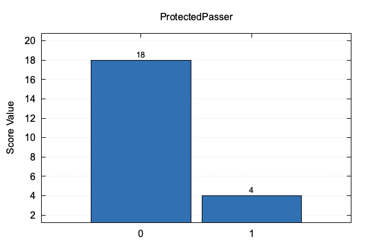

Middle Game: 20 | End Game: 5

## PasserKingDist

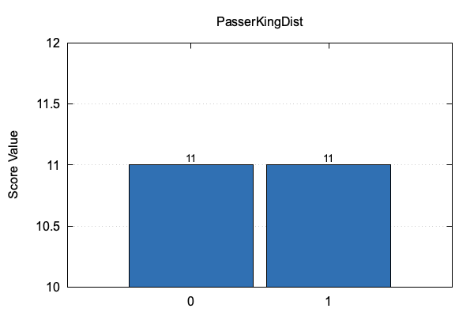

Middle Game: -5 | End Game: 12

## PasserRank

## DoubledPawns

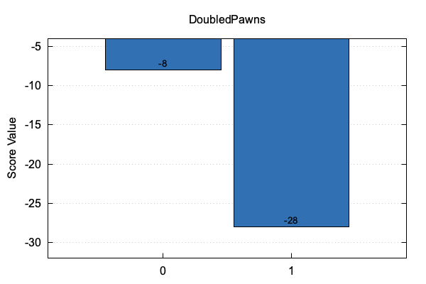

Middle Game: -13 | End Game: -14

## IsolatedPawns

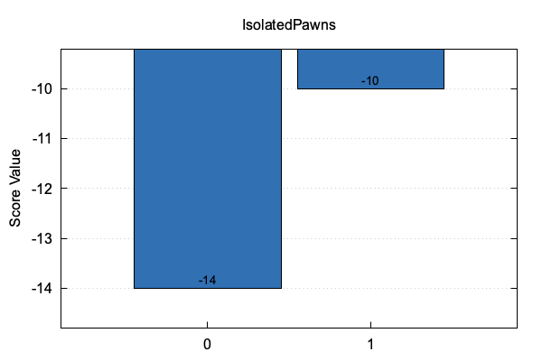

Middle Game: -13 | End Game: -14

