# Chess Evaluation Coefficients Visualization

## PSqT Pawn MiddleGame

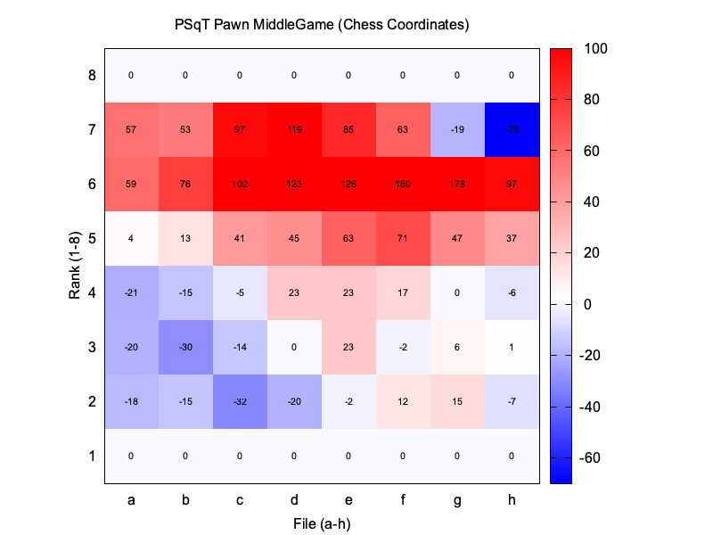

## PSqT Pawn EndGame

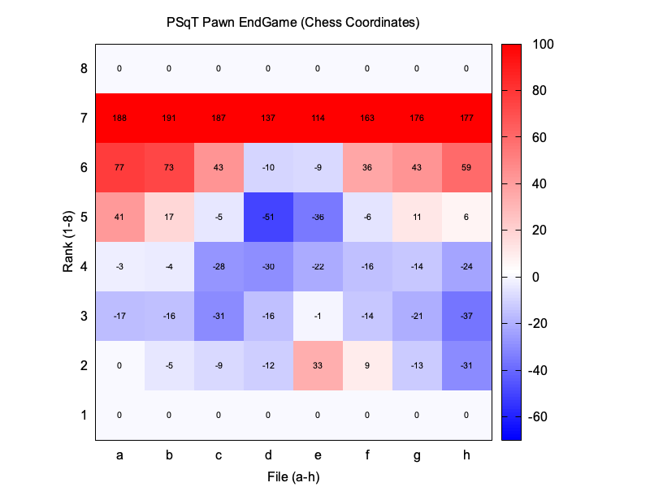

## PSqT Knight MiddleGame

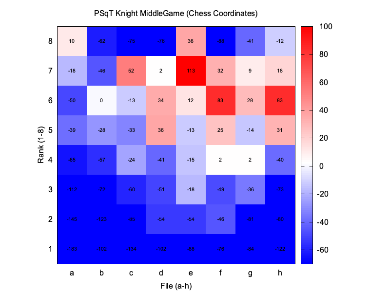

## PSqT Knight EndGame

## PSqT Bishop MiddleGame

## PSqT Bishop EndGame

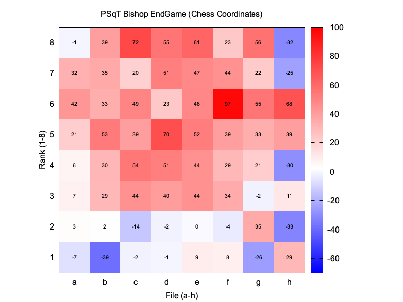

## PSqT Rook MiddleGame

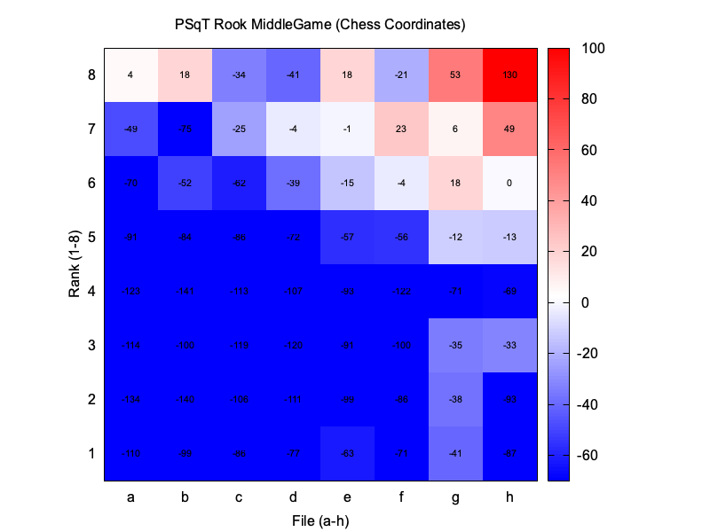

## PSqT Rook EndGame

## PSqT Queen MiddleGame

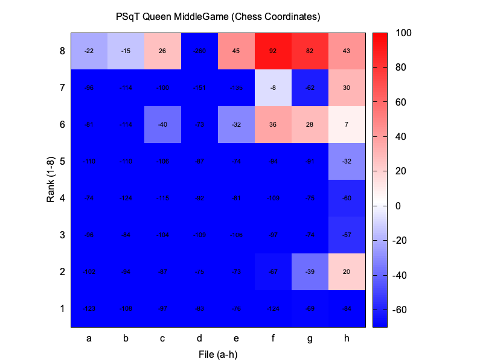

## PSqT Queen EndGame

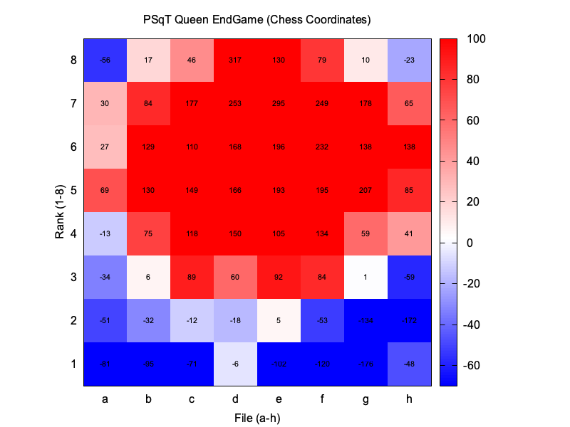

## PSqT King MiddleGame

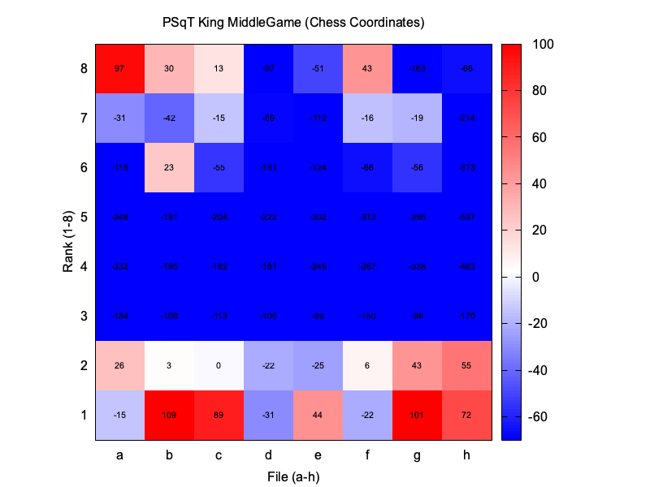

## PSqT King EndGame

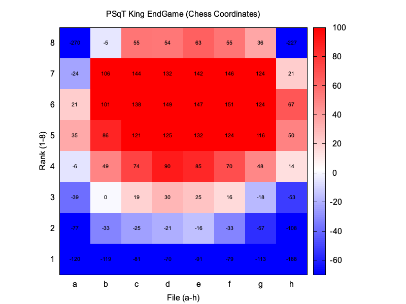

## PieceValues

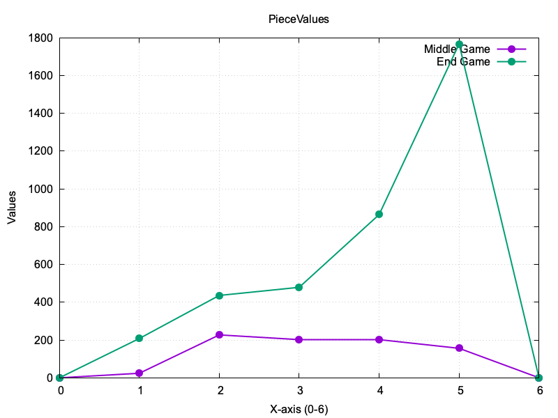

## TempoBonus

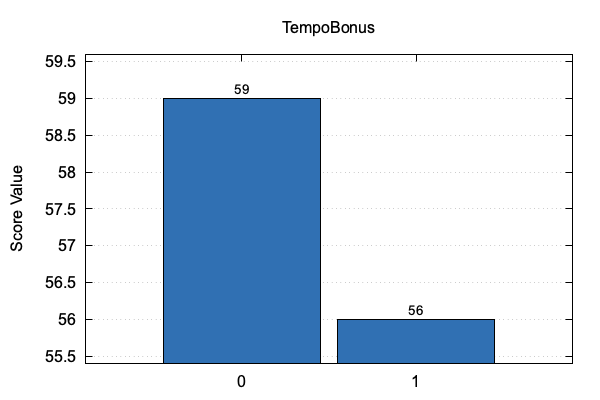

Middle Game: 25 | End Game: 23

## KingAttackPieces

## SafeChecks

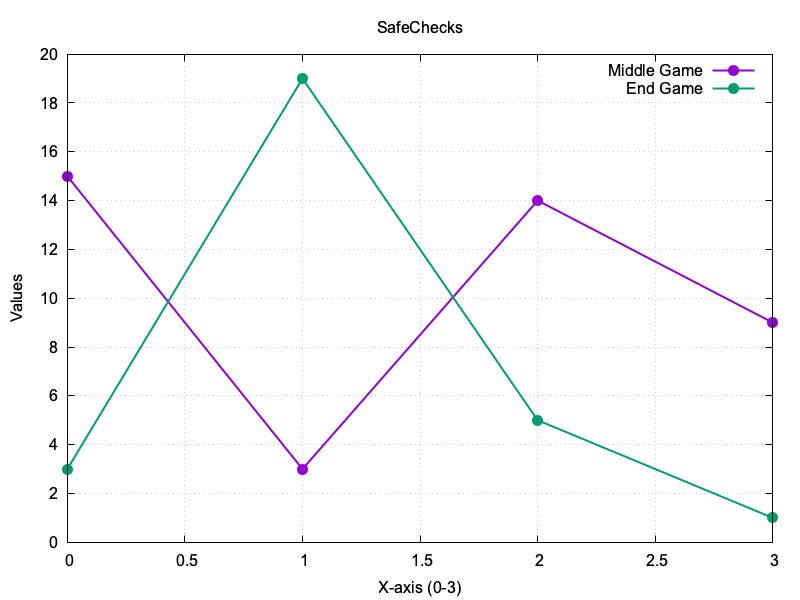

## KingShelter

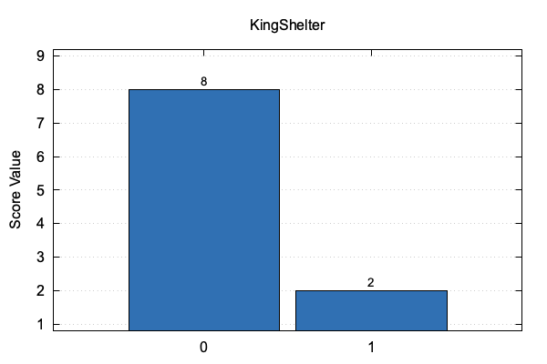

Middle Game: 7 | End Game: -6

## MobilityKnight

## MobilityBishop

## MobilityRook

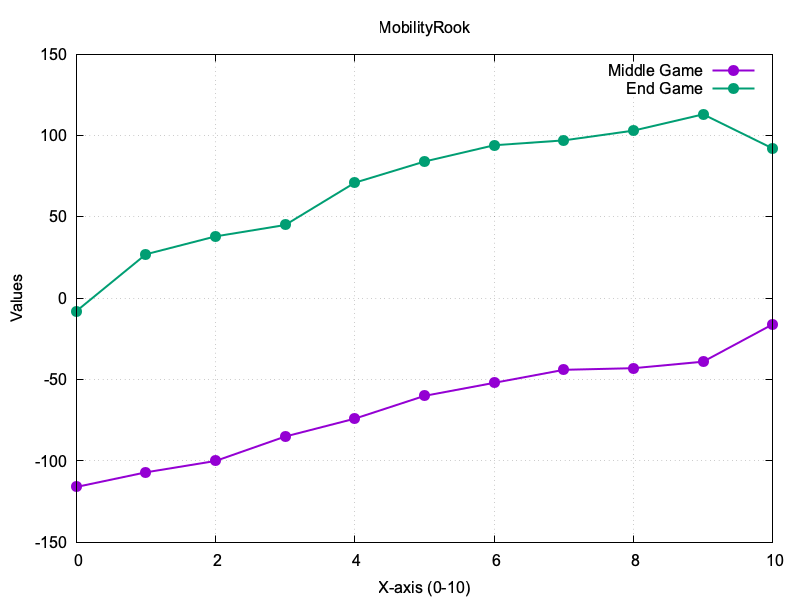

## KnightOutpost (Middle Game)

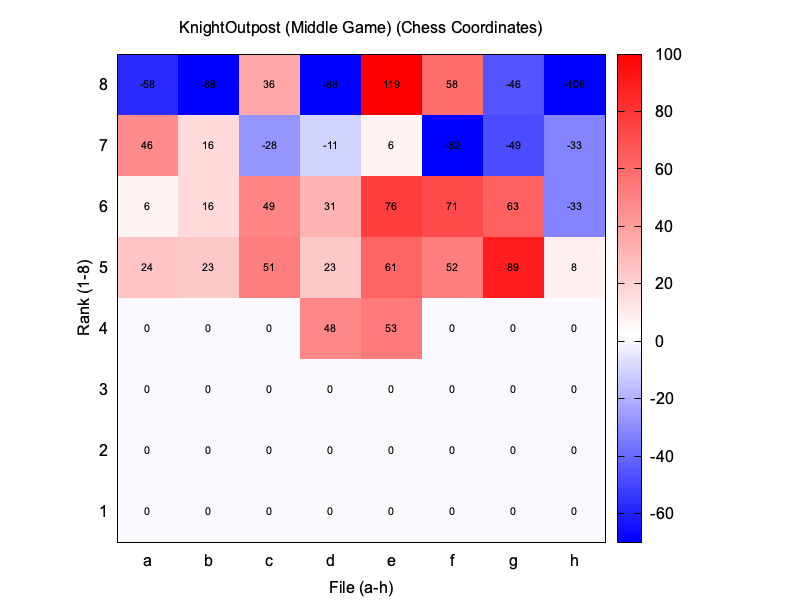

## KnightOutpost (End Game)

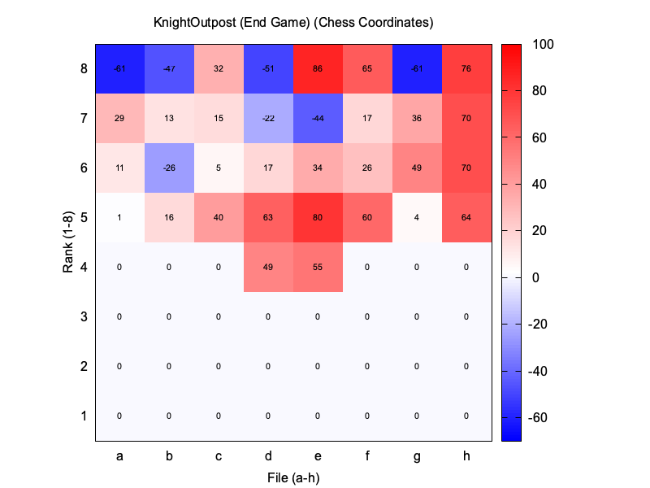

## ConnectedRooks

Middle Game: 1 | End Game: 7

## BishopPair

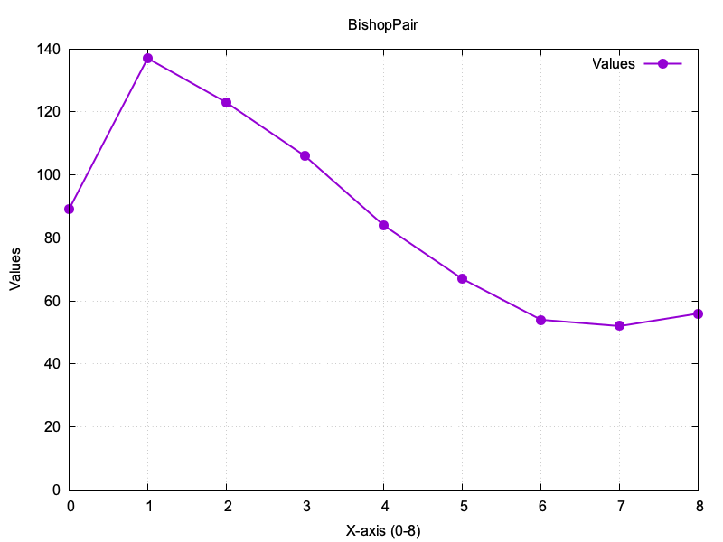

## ProtectedPasser

Middle Game: 22 | End Game: 5

## PasserKingDist

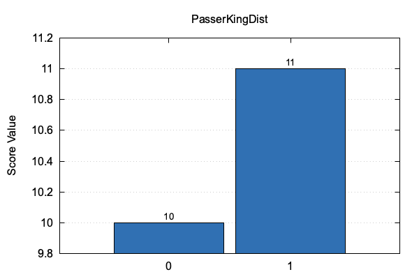

Middle Game: 8 | End Game: 8

## PasserRank

## DoubledPawns

Middle Game: -9 | End Game: -16

## IsolatedPawns

Middle Game: -16 | End Game: -11

