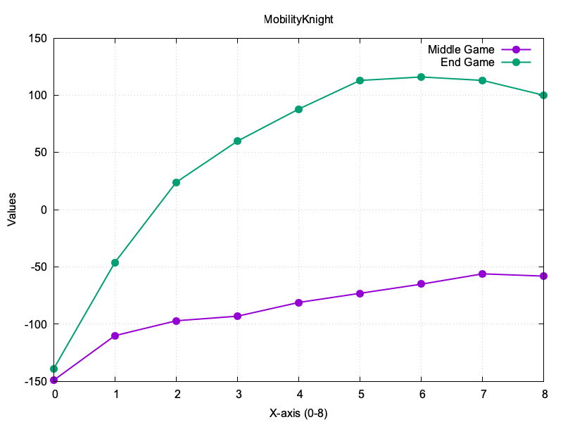
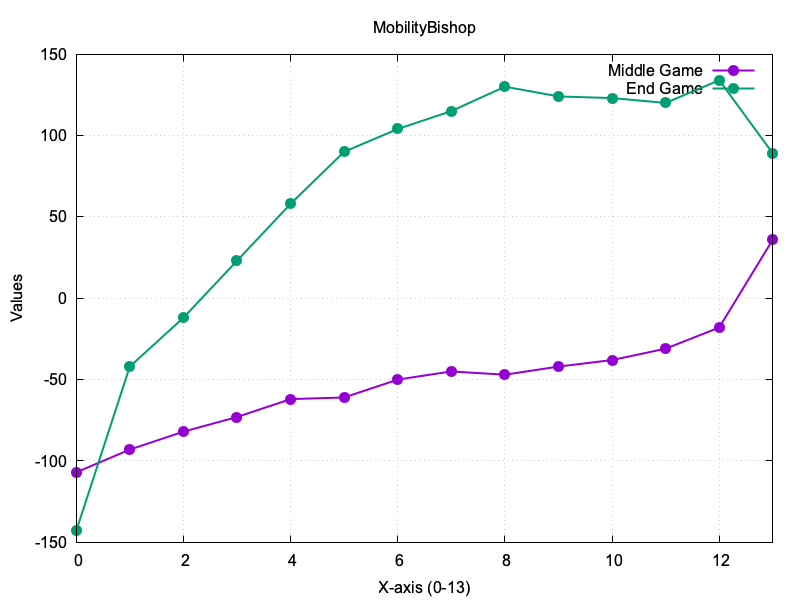
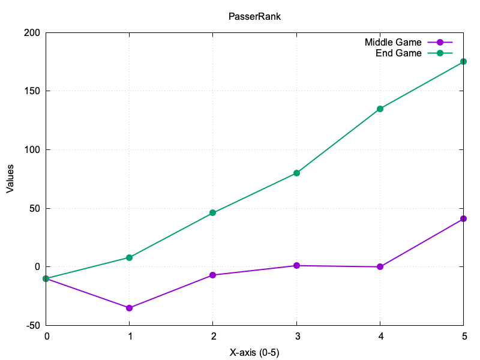

# Chess Evaluation Coefficients Visualization

## PSqT 0

## PSqT 1

## PSqT 2

## PSqT 3

## PSqT 4

## PSqT 5

## PSqT 6

## PSqT 7

## PSqT 8

## PSqT 9

## PSqT 10

## PSqT 11

## PieceValues

## KingAttackPieces

## SafeChecks

## MobilityKnight

## MobilityBishop

## MobilityRook

## KnightOutpost

## PasserRank

